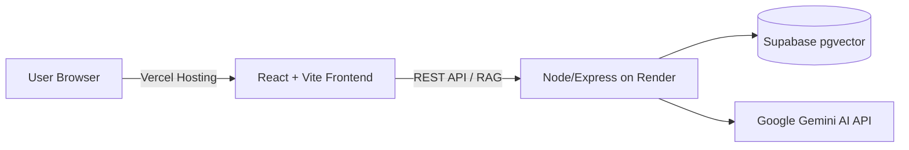

# DeepDive Deployment Guide: Vercel (Frontend) & Render (Backend)

This guide walks you through deploying the DeepDive application with the **Backend on Render** and the **Frontend on Vercel**.

---

## Architecture Overview



---

## Step 1: Deploy Backend on Render

### 1. Create a New Web Service on Render
1. Go to [dashboard.render.com](https://dashboard.render.com/) and click **New +** → **Web Service**.
2. Connect your GitHub repository (`Crux` / `Deepdive`).
3. Fill in the following settings:
   - **Name**: `deepdive-backend` (or your preferred name)
   - **Root Directory**: `server`
   - **Environment**: `Node`
   - **Build Command**: `npm install`
   - **Start Command**: `npm start`
   - **Plan Type**: `Free`

### 2. Configure Environment Variables on Render
Under the **Environment** tab, add the following environment variables:

| Key | Value / Example | Notes |
|---|---|---|
| `NODE_ENV` | `production` | Production mode |
| `SUPABASE_URL` | `https://xxxx.supabase.co` | From Supabase Project Settings → API |
| `SUPABASE_SERVICE_ROLE_KEY` | `eyJhbGciOi...` | Supabase `service_role` secret key |
| `EMBEDDING_PROVIDER` | `gemini` | Or `openai` |
| `LLM_PROVIDER` | `gemini` | Or `openai` |
| `GOOGLE_API_KEY` | `AIzaSy...` | Your Gemini API Key |
| `ALLOWED_ORIGINS` | `http://localhost:5173,*.vercel.app` | Comma-separated or include your Vercel domain |

> 💡 **Tip:** Once Vercel assigns your production domain (e.g. `https://deepdive.vercel.app`), update `ALLOWED_ORIGINS` to include `https://deepdive.vercel.app`.

### 3. Deploy and Copy Render Backend URL
- Click **Create Web Service**.
- Wait for the build to finish until status shows **Live**.
- Test your deployment in your browser or terminal:
  ```bash
  curl https://deepdive-backend.onrender.com/health
  # Should respond with: {"status":"ok"}
  ```
- Copy your Render backend URL (e.g., `https://deepdive-backend.onrender.com`).

---

## Step 2: Deploy Frontend on Vercel

### 1. Import Repository on Vercel
1. Go to [vercel.com](https://vercel.com/) and click **Add New...** → **Project**.
2. Select your repository.
3. Configure the Project:
   - **Framework Preset**: `Vite`
   - **Root Directory**: `./` (leave default)
   - **Build Command**: `npm run build`
   - **Output Directory**: `dist`

### 2. Configure Environment Variables on Vercel
Under **Environment Variables**, add:

| Key | Value | Description |
|---|---|---|
| `VITE_API_URL` | `https://deepdive-backend.onrender.com` | Your deployed Render backend URL (no trailing slash) |

### 3. Deploy
- Click **Deploy**.
- Vercel will build and assign you a URL (e.g., `https://your-project.vercel.app`).

---

## Step 3: Verify Integration

1. Open your Vercel URL in your browser.
2. Upload a sample Resume (PDF) and Job Description on the intake screen.
3. Verify that the interview session is created, the opening question generates and loads, and the conversation responds with RAG insights.

---

## Note on Free Tier Cold Starts

- Render's Free tier spins down web services after 15 minutes of inactivity.
- If the first request takes ~30-50 seconds to respond, the backend is simply spinning back up. Subsequent requests will be fast.
